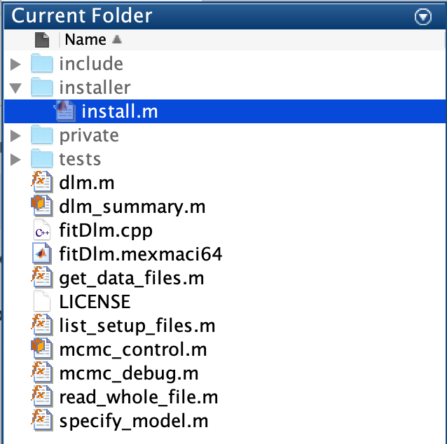
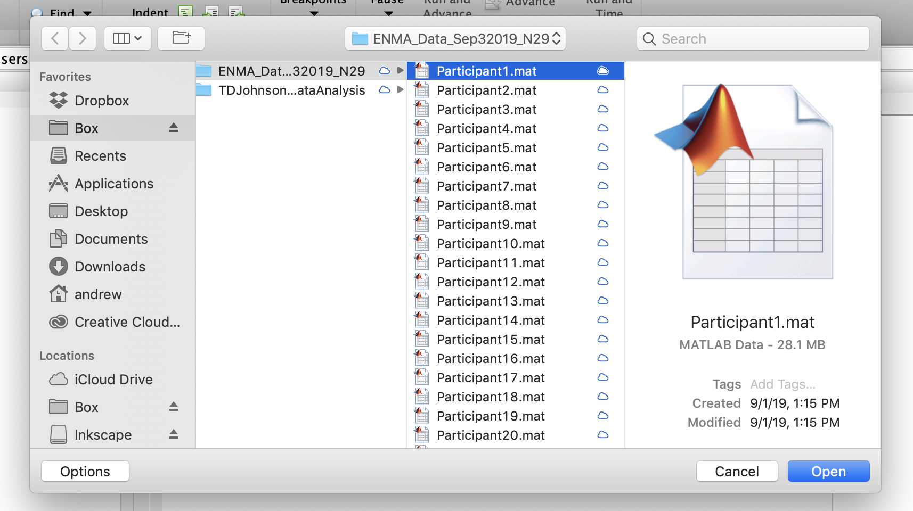
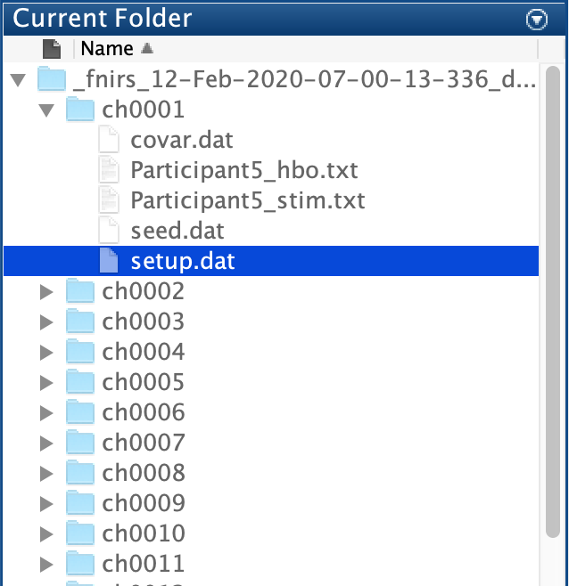

## fNIRS1: MATLAB interface for Dr. Johnson’s C suite for dynamic linear models

Please email me at awhitem@umich.edu to suggest additional features or
especially if I can make the help pages more clear.

#### Outstanding questions/comments
 - How to best format model output for ease of use?
 - Will the software ever need to be run from a PC?

#### Prerequisites
 - Matlab's Statistics and Machine Learning Toolbox
 - [FFTW3](http://www.fftw.org/) needs to be installed separately
   - On OSX, this is quite easy with `homebrew` installed: from a
   terminal, the command is simply `brew install fftw`
   - On Ubuntu, for example, open an admin terminal and run `sudo apt-get install fftw`
   - You need to know the location of a file called `fftw3.h`, which comes
   with FFTW3. On my MacBook, this file is found in
   `/usr/local/include/fftw3.h`
 - [Xcode](https://developer.apple.com/xcode/) may need to be
   installed if running on a Mac
   - This can be done by running `xcode-select --install` from a
     terminal. This may take a while. Once finished, check that the
     command `clang++ --version` outputs something official
     looking. On my MacBook, I have,
	 ```
	 $ clang++ --version
	 Apple LLVM version 10.0.1 (clang-1001.0.46.4)
	 Target: x86_64-apple-darwin18.7.0
	 Thread model: posix
	 InstalledDir: /Library/Developer/CommandLineTools/usr/bin
	 ```

### Installation
As part of `fnirs1`, we provide an install script for convenient
installation on unix-based operating systems. To install `fnirs1`, copy
the `+fnirs1` folder and all its contents to any available
location. Navigate to `+fnris1/installer/` and at the MATLAB prompt,
execute, 
```MATLAB
>> run install.m
```

<p align="center"></p> 


Note that that script uses variables called `FFTW_HOME` and `FFTW_LIB`
which may need to be set before running `install.m`. On my MacBook, I
have `FFTW_HOME` set to `/usr/local/include` to reflect the location
of `fftw3.h`, and `FFTW_LIB` set to `/usr/local/lib` for the
`libfftw3*` set of files.

<p align="center"></p> 

If the install script finishes successfully, information will print to
the MATLAB command window, and the directory above `+fnirs1` will be
permanently added to the MATLAB search path so that `fnirs1` commands
will always be accessible. Try running,
```MATLAB
>> help fnirs1.dlm
```
in MATLAB to verify that the installation worked correctly.


### Fitting participant-level models

The primary model fitting tool in our package is a function called
`fnirs1.dlm`. This function takes as input a set of data files and
returns a model summary object. Basic syntax is, 
<pre>
```
>> fit = fnirs1.dlm(data_files, <i>Option</i>, <i>OptionValue</i>);
```
</pre>

This function comes with sensible defaults so that the user needs only
input locations of participant files to conduct an
analysis. `fnirs1.dlm` will make copies of the data into a temporary
folder for analysis (marked with the current date and time), and will
run analyses based on `setup.dat` files written for each channel within
this folder. If the data files argument is left as an empty string,
MATLAB will open a UI window and ask the user to select files by hand,
```MATLAB
>> fit = fnirs1.dlm('');
```

<p align="center"></p>

For a single-subject analysis over all fNIRS channels, select only one
participant file. This file should contain variables named `hbo`, `hbr`,
`hbt`, `s`, and `t`. Any optional model parameters that can also be
set/tweaked can also be set via this function. For example, a complete
subject data analysis might stem from the command,
```MATLAB
>> fit = fnirs1.dlm('', 'DownSampleRate', 10, 'SpecificChannels', 1:4);
```

where `'DownSampleRate'` instructs the program to down-sample the data
by a factor of 10. The program will error if for example 10 is not an
integer factor of the participant’s original sampling rate (which was
50 Hz in this case). Optional parameters are handled internally by a
function called `fnirs1.specify_model`, and at the time of writing
include, 
#### Options
- `'DownSampleRate'` - Integer down-sampling factor of participant’s sampling rate
- `'McmcControl'` - An `fnirs1.mcmc_control` object to specify MCMC options
- `'GroupData'` - A `table` with demographic information (group
  analyses). There are two special/reserved names that should never
  appear in your GroupData table directly (they're
  case-sensitive). These are `Cond` for within-task conditions, and
  `TempDeriv` for temporal derivatives from HRFs corresponding to
  those within-task conditions.
- `'GroupFormula'` - A model formula to specify what group level model
 you want to fit using the data in the `GroupData` table. This will
 look something like, `'y ~ age + sex + task * Cond'`. Always put
 `Cond` last of the categorical covariates in a model formula.
- `'OutcomeType'` - Character. Should be one of {`'hbo'`, `'hbr'`, `'hbt'`}
- `'SpecificChannels'` - Integer vector index to specify analyses on
  subsets of channels
  
<p align="center"></p>

After parsing the user input and writing the temporary files,
`fnirs1.dlm` fits Dr. Johnson’s dynamic linear models to the data from
each channel separately with Markov Chain Monte Carlo based
methods. Once analyses are complete, the temporaries are compressed
to save space, and an `fnirs1.dlm_summary` object is returned. This
object contains information about the fitted models, and displays
that information in a (hopefully) convenient format. For example,
printing, 
```MATLAB
>> fit = fnirs1.dlm('', 'DownSampleRate', 10, ...
  'SpecificChannels', 9, 'McmcControl', fnirs1.mcmc_control(1000))
Reading participant data files and writing temporaries.
This may take a minute
	Files written for: 3081_Chinese_Task1
Model setup complete
0....100....200....300....400....500....600....700....800....900....1000

Please see file Parameter_Estimates.log for parameter estimates and summaries

fit = 

	DLM Summary: ch0009
Parameter                                     Estimate  Std.Err. 95.0% Cred.Int.  
--------------------------------------------------------------------------------
3081_Chinese_Task1_hbo Cond 1: HRF                1.944  1.244     (-4.41, 0.55) 
3081_Chinese_Task1_hbo Cond 2: HRF                3.162  1.347      (0.45, 5.81) *
3081_Chinese_Task1_hbo Cond 3: HRF                1.085  1.442     (-3.71, 1.75) 
--------------------------------------------------------------------------------

...
```

outputs lots of information about parameter estimates for each
channel. The Parameter field is truncated to save space while
printing, but full parameter descriptions can be extracted via,
```MATLAB
>> fit(1).Descriptions

ans =

  3×1 cell array

    {'3081_Chinese_Task1_hbo Cond 1: HRF'}
    {'3081_Chinese_Task1_hbo Cond 2: HRF'}
    {'3081_Chinese_Task1_hbo Cond 3: HRF'}
```

Similarly, the coefficient estimates, their standard errors, and the
posterior credible intervals can be extracted by accessing the
`Estimates`, `StdErrors`, and `Intervals` fields, respectively. 

We recommend running abbreviated test-analyses to make sure the models
will run before proceeding with full analyses. fnirs1 includes a
convenience function, `fnirs1.mcmc_debug` to help specify short MCMC
chains, and the `'SpecificChannels'` option to reduce data
processing. Users can run a shortened analysis, for example with the
command,
```MATLAB
>> summary = fnirs1.dlm(‘’, ‘DownSampleRate’, 10, ... 
	‘McmcControl’, fnirs1.mcmc_debug, ‘SpecificChannels’ = [1:4]);
```

If this command runs smoothly, then we suggest running full analyses
with longer MCMC chains. The default MCMC options run for 3,000
iterations, which should be sufficient for most analyses,
```MATLAB
>> fnirs1.mcmc_control

ans = 

  mcmc_control with properties:

                burnin: 1000
         expectedKnots: 15
    includeDerivatives: 0
         maxIterations: 3000
```


### Fitting group-level models

Specifying group-level analyses is largely similar to single-subject
analyses, but in general, group-analyses take longer to run than
single-subject. If the user selects more than one participant’s data
file, `fnirs1.dlm` will automatically conduct a group-level
analysis. For example, continuing with the short debug chains options,
and with,
```MATLAB
>> fit = fnirs1.dlm(data_files, ...
    'GroupData', demo, ...
    'GroupFormula', 'ID ~ Task * Cond + LWIDraw + Age', ...
    'DownSampleRate', 10, ...
    'SpecificChannels', 9:10, ...
    'McmcControl', fnirs1.mcmc_control(30, false));
Reading participant data files and writing temporaries.
This may take a minute
	Files written for: 3081_Chinese_Task1
	Files written for: 3082_Chinese_Task1
	Files written for: 3083_Chinese_Task1
	Files written for: 3084_Chinese_Task1
	Files written for: 3085_Chinese_Task1
	Files written for: 3081_Chinese_Task2
	Files written for: 3082_Chinese_Task2
	Files written for: 3083_Chinese_Task2
	Files written for: 3084_Chinese_Task2
	Files written for: 3085_Chinese_Task2
Model setup complete
0.

Please see file Parameter_Estimates.log for parameter estimates and summaries
0.

Please see file Parameter_Estimates.log for parameter estimates and summaries
>> fit

fit = 

	DLM Summary: ch0009
Parameter                                     Estimate  Std.Err. 95.0% Cred.Int. 
--------------------------------------------------------------------------------
Population Effect: Task_1                         1.083  1.573     (-1.90, 3.30) 
Population Effect: LWIDraw                        0.061  0.029      (0.01, 0.11) *
Population Effect: Age                            0.562  0.349     (-1.06, 0.07) 
Population Effect: Task_2                         1.445  1.938     (-2.32, 3.85) 
Population Effect: Cond_2                         0.979  0.913     (-0.82, 2.09) 
Population Effect: Cond_3                         0.164  0.689     (-1.07, 1.37) 
Population Effect: Task_2:Cond_2                  0.683  1.215     (-2.39, 1.45) 
Population Effect: Task_2:Cond_3                  0.322  0.862     (-1.98, 0.76) 
3081_Chinese_Task1_hbo Cond 1: HRF                0.492  0.827     (-2.08, 0.75) 
3081_Chinese_Task1_hbo Cond 2: HRF                1.967  0.963      (0.21, 3.48) *
3081_Chinese_Task1_hbo Cond 3: HRF                0.128  1.105     (-1.88, 1.72) 
3082_Chinese_Task1_hbo Cond 1: HRF                2.413  1.158      (0.82, 4.42) *
3082_Chinese_Task1_hbo Cond 2: HRF                1.680  0.810      (0.29, 3.15) *
... 
```

Inferential statements for group-level parameters are listed at the
top with the 'Population Effect' prefix; participant-level parameter
estimates are given immediately below. 


